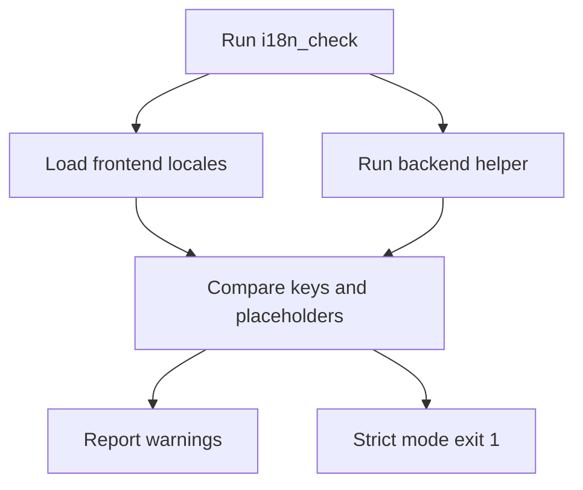

# Standalone i18n Validation Utility Plan

## Summary
Create a standalone utility script in `/scripts` that validates frontend and backend i18n resources without adding test files to the production codebase. The script will read translation sources, check key parity and placeholder parity, and emit warnings by default. A `--strict` flag will exit non‑zero on any issues.

## Current i18n Sources
- Frontend i18next resources: [`frontend/src/i18n/index.ts`](frontend/src/i18n/index.ts:1)
- Frontend locales: [`frontend/src/i18n/locales/en.ts`](frontend/src/i18n/locales/en.ts:1), [`frontend/src/i18n/locales/de.ts`](frontend/src/i18n/locales/de.ts:1), [`frontend/src/i18n/locales/ja.ts`](frontend/src/i18n/locales/ja.ts:1)
- Backend notifications i18n: [`backend/app/i18n/__init__.py`](backend/app/i18n/__init__.py:1)
- Scripts folder for utilities: [`scripts`](scripts:1)

## Proposed Utility Design

### Location and Entry Point
- New script: `scripts/i18n_check.js` (Node) as the single entry point.
- It will invoke a small Python helper for backend parsing, or directly parse backend JSON via Python subprocess.
- Output: human‑readable console summary plus machine‑readable JSON when `--json` flag is passed.

### Execution Modes
- Default: warnings only, exit code `0` even with issues.
- `--strict`: exit code `1` if any missing keys, extra keys, or placeholder mismatches are found.
- `--scope frontend|backend|all` to limit checks.

### Checks

#### Frontend checks
- **Key parity:** recursively flatten keys for `en`, `de`, `ja` and compare against `en`.
- **Placeholder parity:** for each string, ensure `{{var}}` tokens match across locales.
- **Optional smoke translate (no runtime):** ensure values are strings and not empty for leaf nodes.

#### Backend checks
- **Key parity:** compare keys in `EN` and `DE` inside [`backend/app/i18n/__init__.py`](backend/app/i18n/__init__.py:1).
- **Placeholder parity:** compare `{var}` tokens in corresponding strings.
- **Formatting safety:** simulate formatting by verifying required placeholders exist (no execution of backend runtime).

## Implementation Approach

### Node orchestrator (`scripts/i18n_check.js`)
- Read frontend locale files by importing with `ts-node/register` or using `tsx` to allow TS imports.
- For backend, spawn Python helper `scripts/i18n_check_backend.py` to emit JSON of keys/placeholders.
- Aggregate results and print a summary table.

### Python helper (`scripts/i18n_check_backend.py`)
- Import `backend.app.i18n` and serialize `EN`, `DE` into JSON.
- Extract key paths and placeholder sets with a small recursive walker.
- Print JSON to stdout for Node to consume.

## Output Format
- Human‑readable:
  - Counts of missing/extra keys per locale.
  - Counts of placeholder mismatches.
  - List of top N mismatches with full key paths.
- JSON (`--json`): structured list of issues for CI or tooling.

## README Additions
Add a short section in [`README.md`](README.md:1) under Contributing or Development:
- Usage:
  - `node scripts/i18n_check.js`
  - `node scripts/i18n_check.js --strict`
  - `node scripts/i18n_check.js --scope frontend`

## Mermaid Flow

## Acceptance Criteria
- Script runs without modifying production code or adding tests.
- Warnings are produced on discrepancies; strict mode fails the run.
- README documents usage for the utility.

## Next Steps
- Confirm preferred CLI flags and output format.
- Approve the plan, then switch to Code mode to implement scripts and README updates.
